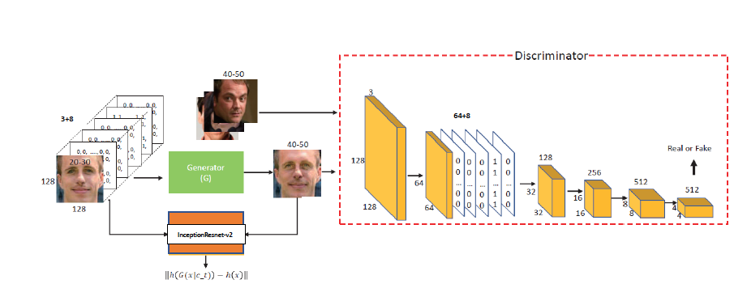
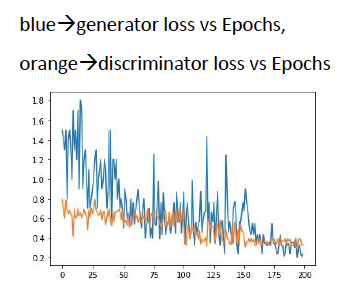
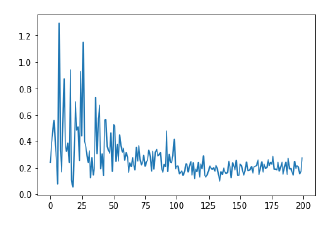
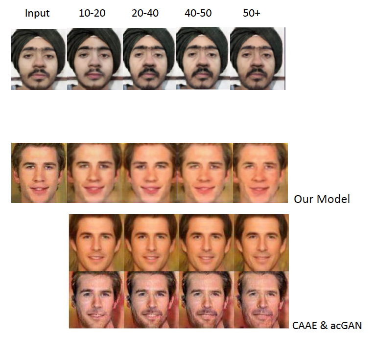
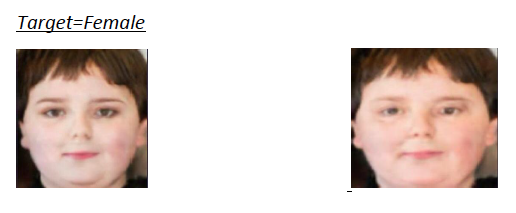
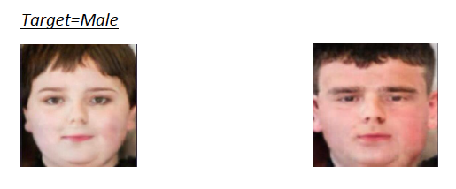

# Face Aging using IPCGANS

Face aging as we know it in today’s world has many applications such as Entertainment purpose, cross age face verification to find missing children, or missing person in general. But since it is not possible to generalize a face for different people at a particular age because of lack of organized data of same person in sequential age. So, we aim to generate an aged face in an age group instead of a particular age. We also know that there are many challenges faced in this process, foremost is to preserve the identity of a person while simultaneously ageing it. 

<b>By grouping people into different age groups, we transfer average features of target age to the face to be aged.
So, we implement the Identity Preserved Conditional GANs. We further improvise by categorizing the faces based on Gender, and determine how this affects the original algorithm.</b> 

In the algorithm conditional generative adversarial network generates the target age conditioned face for input image and the identity preserving res-net model preserves the input face features.   

## Conditional generative adversarial model
The generative adversarial model consists of two parts,
This cGAN model takes an input image and target age, and generate aged face in target age group. 
To make the Adversarial network model conditional we feed the condition (age and gender) as an additional layer in the input to both discriminator and generator model. 

  <b>Model</b>
  

## Loss Graphs
We used the preprocessed imdb-wiki dataset(60000 images) with age and gender labels for the training purpose, we take age and gender condition and classify them into 10 groups. The learning rate for IPCGAN is set to 0.001 and a batch size of 10 images is used with total of 1000000 steps for IPCGAN training. 
### Before and after identity preservation
It can be seen that after identity preservation model was applied the generator loss decreased which led to better results with face identity preserved.

  
  

## Results

We got better results than the current existing models, as we did identity preservation and moreover we also added another condition with age that was gender.

  

## Improvement
There is a recognizable feature difference when we give target condition as a female v/s male which confirms the improvement in the model. 
Much better result could have been achieved, if a better dataset could be made keeping in mind the feature similarity in faces in the young age region by adding a large number of images in region of 10-30 years.

  

  

                                                              
## Further Scope
We introduced the Gender condition to shape the model to better learn the aging pattern.
If a better labelled dataset with age, gender and <b>race</b> can be designed, we can get much better results, as race also plays a very important role in the aging pattern.
                                                              
                                                              
<b>Reference</b>: X. Tang, Z. Wang, W. Luo and S. Gao, "Face Aging with Identity-Preserved Conditional Generative Adversarial Networks," 2018 IEEE/CVF Conference on Computer Vision and Pattern Recognition, Salt Lake City, UT, 2018, pp. 7939-7947, doi: 10.1109/CVPR.2018.00828.                                                              
                                                              
                                                              
                                                   
